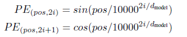

# Transformer

文本分类不是生成式的任务，因此只使用了Transformer的编码部分（encoder）。

### Encoder结构

在Transformer的Encoder中，数据会依次经过'self-attention'模块和'Feed Forward Neural Network'模块。

**self-attention：**

模块的公式为：
$$
Attention(Q,K,V)=softmax(\frac{QK^T}{\sqrt{d_k}})V
$$
在self-attention中，每个单词有3个不同的向量，分别是Query向量（Q）、Key向量（K）和Value向量（V），它们是由词嵌入向量乘以3个不同的权值矩阵得到的。$d_k$是K的维度。

**Feed Forward Neural Network：**

模块包括两个全连接层，第一层的激活函数是ReLU，第二层是线性激活函数，公式为：
$$
FFN(Z)=max(0,ZW_1+b_1)W_2+b_2
$$
最后，为了解决深度学习的退化问题，加入了short-cut结构。

### 模型结构

1.词嵌入部分

在常规的embedding层之后增加了位置编码（position embedding）。

由于attention没有包含位置信息，因此增加了position embedding来加入位置信息。位置编码公式如下：

2.编码层部分

包括2个Encoder。其中，每个Encoder包含两个模块：'Multi-Head Attention'和'Feed Forward Neural Network'。Multi-Head Attention相当于多个不同的self-attention的集成。

3.输出层

输出的维度是类别的个数，即2.

### 程序说明

extract_origin_data.py：将原始数据集转换为二分类的数据集，训练集保存为train.xlsx，验证集和测试集保存为valid.xlsx，保存在data文件夹中。

models/Transformer.py：文本二分类模型的搭建。

utils.py：数据集读取、词典构建等功能函数的实现。

train_eval.py：模型的训练、测试和调用函数的实现。

**run.py：程序的运行入口，最后一行train函数的mode参数设置为'train'时功能是训练模型，设置为'predict'时功能是调用训练好的模型进行预测并输出准确率。**

词典和训练好的模型都存储在data文件夹中。

### 运行结果

训练集有2500条原始数据，即10000条二分类数据；验证集和测试集都是500条原始数据，即2000条二分类数据。

最终在验证集上的准确率是0.302，测试集上的准确率是0.308.