# Transformer

### 1. Why Transformer?

LSTM的缺点：

长期依赖问题导致梯度消失；时序模型，模型的内部只支持串行计算，导致效率低。

Transformer的解决方法：

在self-attention中两两计算score，每个单词的重要性都是相同的，不会因为在句中的距离过远而导致重要性下降。

与时序无关，可以并行计算，便于利用GPU的算力。

LSTM中考虑上下文的方法是时序机制，Transformer中考虑上下文的方法是attention机制。

### 2. Transformer详解

我们以机器翻译任务为例，对Transformer进行详细的介绍。

#### 2.1 高层次的结构展示

Transformer在解决机器翻译任务时可概括为图1：

​                                                       图1 Transformer在解决机器翻译任务时的概括

在总体上看，Transformer由ENCODERS和DECODERS组成，那么图1可以表示为图2的形式：

​                                                                       图2 Transformer的总体结构

如图3所示，ENCODERS是由6个编码block组成（也就是每个block都是一个ENCODER），DECODERS是由6个解码block组成（也就是每个block都是一个DECODER）。ENCODERS和DECODERS中的block数量要相同，这里block的数量可以凭借经验设定。其中，最后一层ENCODER的输出会输入到所有DECODER中，作为每个DECODER的输入之一。

​                                                                   图3 Transformer的总体详细结构

ENCODER的结构如图4所示，数据首先经过Self-Attention模块，这个模块起到了考虑上下文的作用，再经过Feed Forward Neural Network模块，这个模块相当于两个全连接层，具体的细节在之后介绍。

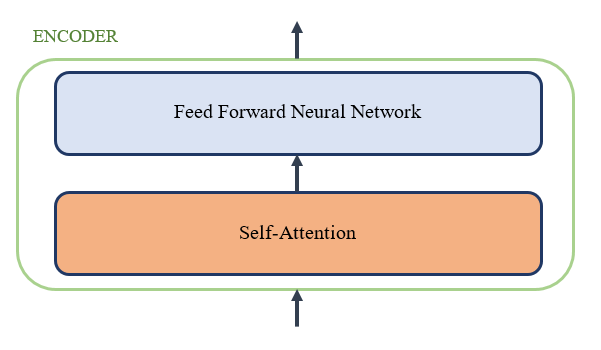

​                                                                            图4 ENCODER的结构

DECODER的结构如图5所示，与ENCODER相比多了一个Encoder-Decoder Attention。其中，Self-Attention模块的作用是考虑当前翻译的单词和已经翻译好的前文的关系，Encoder-Decoder Attention的作用是考虑当前翻译的单词和最后一层ENCODER的输出之间的关系。具体细节在之后介绍。

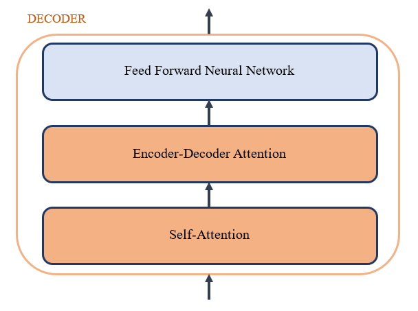

​                                                                            图5 DECODER的结构

#### 2.2 Transformer的输入

实际上，Transformer模型的输入有两个，一个是ENCODERS的输入，一个是DECODERS的输入。以机器翻译任务为例，ENCODERS的输入是翻译的原文，DECODERS的输入是模型之前翻译得到的译文。例如，在翻译‘Je suis etudiant’这句话时，模型之前已经翻译出了'I am a'，则ENCODERS的输入是‘Je suis etudiant’，DECODERS的输入是'I am a'。

Transformer的两个输入的格式是相同的，下面以ENCODERS的输入为例进行介绍。

​                                                                     图6 Transformer中ENCODERS的输入

**EMBEDDINGS:**

如图6所示，首先通过Word2Vec等词嵌入方法将输入的语料转化为词向量，即图6中的EMBEDDINGS。

**POSITIONAL ENCODING:**

为了捕捉输入序列的顺序信息，引入了位置编码的方法，即图6中的POSITIONAL ENCODING，这样Transformer就能够区分不同位置的单词了。编码位置信息的常见方法有：a.根据数据学习；b.自己设计编码规则。Transformer模型采用第二种方式，编码公式如下：
$$
PE(pos,i)=\begin{cases} sin(\frac{pos}{10000^{{i}/{d_{model}}}}), i为偶数
\\ cos(\frac{pos}{10000^{(i-1)/{d_{model}}}}), i为奇数 \end{cases}
$$
其中，PE是positional encoding的缩写。pos即position，表示单词在句子中的位置，设句子长度为4，则pos=0,1,2,3。$d_{model}$为词向量的维度，i表示词向量的某一维度，设词向量维度为512，则$d_{model}$为512，i=0,1,2,...,511。i为偶数时用第一个公式，i为奇数时用第二个公式。之后又加入了三角函数，这样既能考虑到单词的绝对位置，也能考虑到单词的相对位置。

以例子的输入‘Je suis etudiant’为例，设词向量维度为4，pos=0,1,2，$d_{model}$=4，i=0,1,2,3. 在计算句子中的第一个单词(即pos=0)的位置编码时，将i=0,1,2,3分别带入公式计算，得PE(0,0)=0,PE(0,1)=1,PE(0,2)=0,PE(0,3)=1,组合成为一个4维的向量[0,1,0,1]，这个向量表示的就是第一个单词的位置信息，且向量的维度与词向量的维度相同。类似的，第二个单词(即pos=1)的位置编码为[0.84,0.54,0.01,1]，以此类推。

最后将EMBEDDINGS和POSITIONAL ENCODING相加得到最终的输入EMBEDDING WITH TIME SIGNAL。值得注意的是，这个输入只是最底层的block的输入，也就是图6中ENCODER #0的输入，之后其他层的输入则是上一层的输出。

DECODERS的输入类似，也是将EMBEDDINGS和POSITIONAL ENCODING相加得到最终的输入EMBEDDING WITH TIME SIGNAL。值得注意的是，这个输入只是最底层的block的输入，也就是图6中DECODER #0的输入，之后其他层的输入则是上一层的输出。

#### 2.3 Self-Attention

**Self-Attention at a High Level:**

相同的单词在不同句子中的词向量应该是不同的，然而传统的embedding方法没有考虑到这一点，Self-Attention则能够考虑到上下文的信息来生成向量。Self-Attention可以通过当前单词去查看输入序列中的其他单词，以此来寻找编码这个单词更好的线索。

对Self-Attention的理解如图7所示，以例子的输入‘Je suis etudiant’为例，这句话中的'Je'指的是什么？对于人来说，这个问题很简单，但是对于算法来说这个问题并不简单。Self-Attention就是为了解决这个问题，在编码单词'Je'时，颜色越深表示单词'Je'对它的注意力越高。可以看出'Je'对'etudiant'的注意力最高，这样Self-Attention就把'Je'和'etudiant'联系了起来。

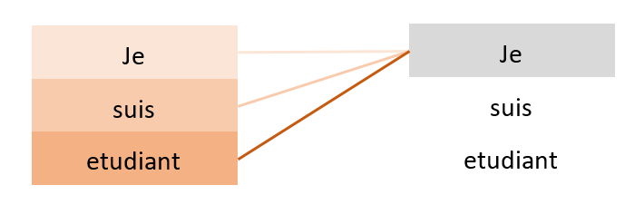

​                                                            图7 Self-Attention模块的理解

**Self-Attention in Detail:**

这里我们先介绍用向量的方式计算Self-Attention，向量方式下Self-Attention的计算公式如下：
$$
Attention(q,k,v)=[softmax(\frac{qk^{T}}{\sqrt{d_k}})]v
$$
计算Self-Attention时，第一步是从每个ENCODER或者DECODER的输入向量上创建3个向量。

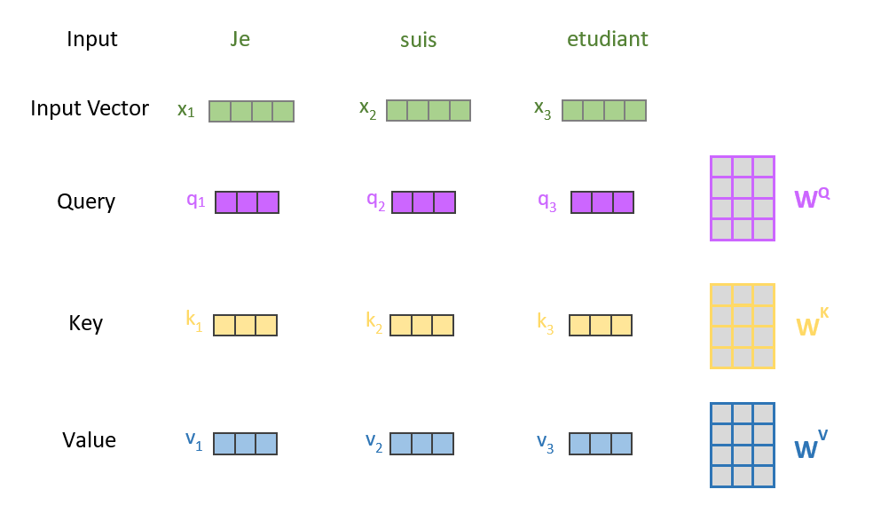

​                                                                           图8 创建q,k,v的过程

如图8所示，对于每个单词，我们创建一个Query向量（q），一个Key向量（k），一个Value向量（v），$d_k$是向量k的维度大小，这3个向量是输入向量分别乘以3个可训练的矩阵而产生的。这3个可训练矩阵的形状相同，都是[输入的向量维度 X $d_k$]，其中$d_k$的值是自己设置的，一般要小于输入向量的维度。即$x_1$乘以$W^Q$得到$q_1$，$x_1$乘以$W^K$得到$k_1$，$x_1$乘以$W^V$得到$v_1$,以此类推。q,k,v这三个向量的概念是很抽象的，但是它确实有助于计算注意力。

之后的计算步骤如图9所示：

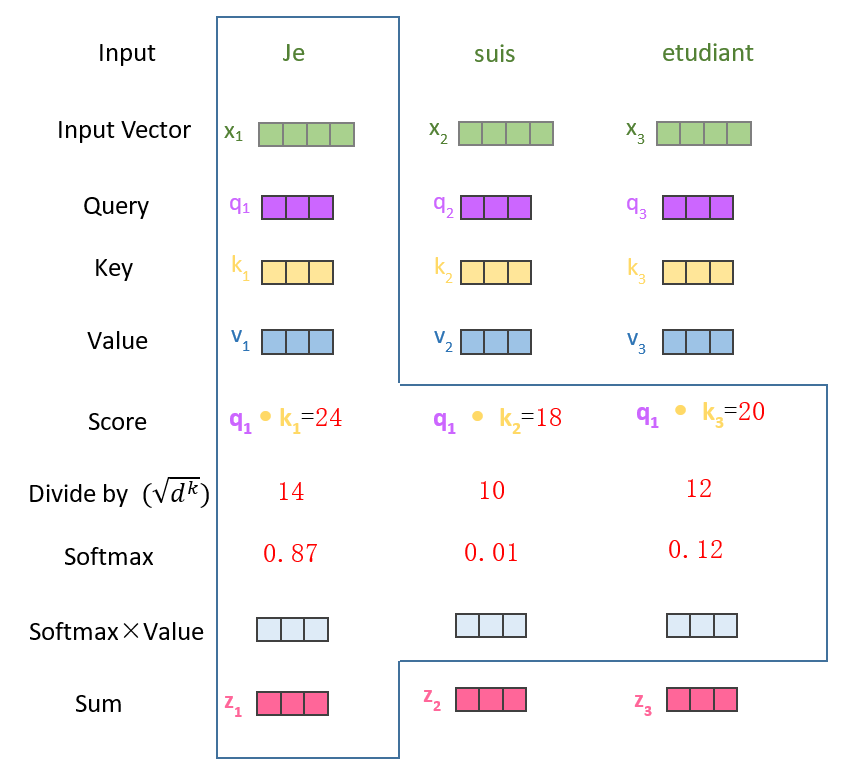

​                                                                图9 Self-Attention模块的计算流程

第二步是计算得分。如图9所示，第一个单词'Je'在经过Self-Attention模块时，我们需要根据'Je'对输入句子中的每个单词进行评分，这个评分决定了'Je'对输入句子中其他单词的关注程度。

将query向量和key向量点乘得到评分（Score），如图9所示，在计算单词'Je'的得分时，将$q_1$与$k_1$点乘得到'Je'和自己的评分，将$q_1$与$k_2$点乘得到'Je'对'suis'的评分，将$q_1$与$k_3$点乘得到'Je'对'etudiant'的评分。

第三步是将第二步的Score除以$\sqrt{d_k}$，$d_k$是key向量的维度，图9中即除以$\sqrt{3}$，这样处理可以使训练过程中具有更稳定的梯度。

第四步是将第三步的结果进行softmax，使得最后的结果和为1。

第五步是将每个value向量乘以对应位置的softmax之后的结果，即value向量中的每个值都乘以softmax的结果。

第六步是将第五步的所有结果累加，即单词'Je'的输出。

**Matrix Calculation of Self-Attention:**

在实际计算中采用的是矩阵的计算方式，以便更快地处理。矩阵形式下Self-Attention的计算公式如下：
$$
Attention(Q,K,V)=[softmax(\frac{QK^{T}}{\sqrt{d_k}})]V
$$
其中，输入从向量变成了矩阵X，X的每一行对应于输入句子中的一个单词，矩阵X分别与可训练的权值矩阵$W^Q$、$W^K$、$W^V$相乘得到query矩阵（Q）、key矩阵（K）、value（V）矩阵。$d_k$是矩阵K每行的维度大小，再将Q、K、V代入到公式中计算得到矩阵X经过Self-Attention之后的输出，输出也是一个矩阵。

#### 2.4 Multi-Head Attention

Multi-Head Attention相当于h个不同的Self-Attention的集成，这里以h=3为例。

有3套不同的权重矩阵与输入矩阵X相乘，相当于从不同的角度看待同一句话。整个过程如图10所示：

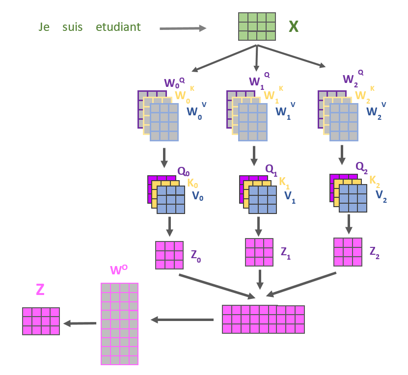

​                                                                   图10 Multi-head Attention模块的结构

第一步，将输入矩阵X在词向量维度上进行3等分，分割后的矩阵分别与3套不同的权重矩阵相乘，得到3套不同的Q、K、V矩阵。

第二步，利用3套不同的Q、K、V矩阵分别计算Self-Attention得到3个不同的Z矩阵。

第三步，将3个Z矩阵按列拼接起来，然后与权重矩阵$W_O$相乘，得到最后的输出矩阵。为了方便计算，Multi-Head Attention的输出矩阵维度通常与输入矩阵维度相等，因此权重矩阵$W_O$的形状为[h*矩阵V每行的维度，输入矩阵X每行的维度]。

值得注意的是，只有第一层ENCODER和第一层DECODER的输入是词嵌入矩阵，而其他层的ENCODER（DECODER）的输入则是上一层ENCODER（DECODER）的输出。

#### 2.5 Feed Forward Neural Network

这个模块很简单，可以理解为对输入进行2次线性映射，可以看做是2个全连接层。

第一个全连接层的激活函数是ReLU，第二个全连接层是一个线性激活函数，Feed Forward Neural Network模块的计算公式如下：

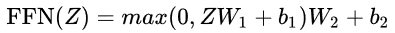

#### 2.6 ENCODER的详细结构

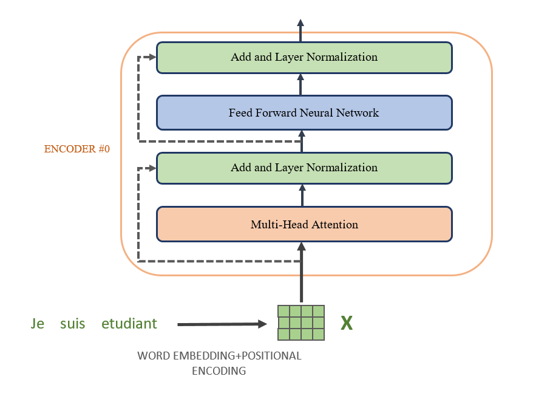

​                                                                          图11 ENCODER的详细结构

以第一层ENCODER为例，如图11所示，第一步，句子经过词嵌入和位置编码后得到矩阵X，作为ENCODER的输入。

第二步，输入矩阵X经过Multi-Head Attention模块。

第三步，为了解决深度学习中的退化问题，加入了残差连接结构，即图11中'Add and Layer Normalization'中的'Add'操作，'Add'操作很简单，即把Multi-Head Attention模块的输出与该模块的输入相加作为最终的输出。

第四步，对'Add'操作之后的结果进行规范化，即'Add and Layer Normalization'中的'Layer Normalization'操作。与Batch Normalization相比，Layer Normalization针对单个训练样本进行，与batch的大小无关。Batch Normalization相当于纵向的规范化，即同一个batch中的所有样本在同一个维度下做规范化，而Layer Normalization相当于横向的规范化，与batch无关，针对单个样本做规范化。

第五步，上一步的结果经过Feed Forward Neural Network模块。

第六步，与三四步的操作相同，即'Add and Layer Normalization'，将Feed Forward Neural Network模块的输出与该模块的输入相加作为最终的输出，之后进行Layer Normalization操作。

#### 2.7 DECODER的详细结构

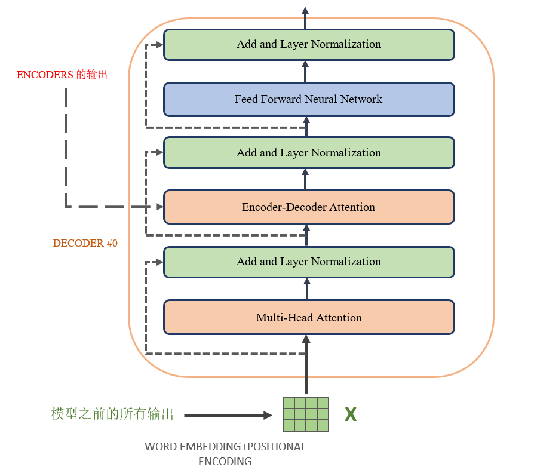

​                                                                         图12 DECODER的详细结构

DECODER的结构与ENCODER类似，以第一层DECODER为例，如图12所示。其中，第一层DECODER的输入是Transformer模型之前的所有的输出。此外，DECODER多了一个Encoder-Decoder Attention模块以及一个对应的'Add and Layer Normalization'模块。

Encoder-Decoder Attention的结构与Multi-Head Attention基本相同，不同的是，Multi-Head Attention是输入矩阵切分后分别与$W^Q$、$W^K$、$W^V$3个权重矩阵相乘得到Q、K、V3个矩阵，而Encoder-Decoder Attention是当前DECODER的Multi-Head Attention经过'Add and Layer Normalization'之后的输出与$W^Q$相乘得到Q矩阵，ENCODERS的输出分别与$W^K$、$W^V$相乘得到K、V2个矩阵，之后的计算与Multi-Head Attention完全相同。

#### 2.8 Transformer的输入输出格式以及mask的使用

**Transformer的输入输出格式：**

在介绍mask的使用之前，我们先介绍一下Transformer模型输入输出的句子的具体格式。

Transformer模型的输入有两个，分别为ENCODERS的输入、DECODERS的输入。其中，ENCODERS的输入为原文，DECODERS的输入是Transformer模型之前的所有输出，之后DECODERS会根据Transformer模型之前的所有输出和ENCODERS的输出预测下一个单词。

**mask的使用：**

mask的含义是掩码，作用就是对某些值进行掩盖，使其不产生效果。

Transformer中涉及到2种mask，分别是padding mask和sequence mask。

**padding mask**

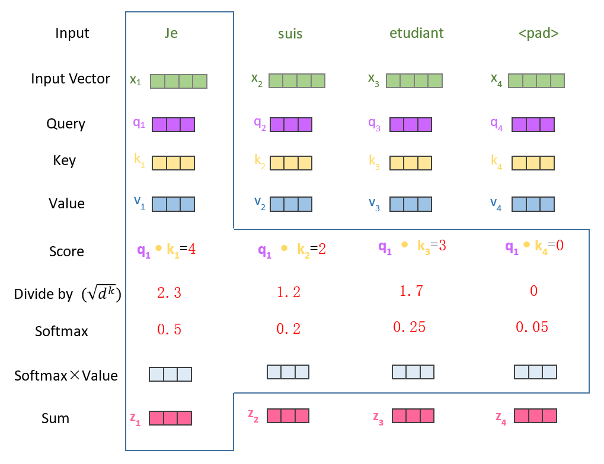

​                                                                      图13 需要padding mask的原因

由于模型每个batch的输入句子长度不一致，因此需要进行padding操作（多裁少补）。如图13所示，虽然padding位置的词向量都是0，但是在Multi-Head Attention的每个Self-Attention计算中，这些值为0的位置在做softmax时也会对结果产生影响。因此，在做softmax之前，我们把这些位置的值设置为负无穷，这样在softmax之后，这些位置的概率就会接近0，避免了padding位置对结果的影响。

padding mask的作用就是把这些位置记录下来，每个batch生成一个矩阵，padding位置记为0，不是padding的位置记为1。例如，输入的batch为['Je suis etudiant P P P', 'Je suis P P P P']时（P为padding的标志），那么生成的矩阵为：

1     1     1     0     0     0

1     1     0     0     0     0

padding mask在所有的Self-Attention计算中都需要用到。

**sequence mask**

由于译文是未知的，因此对译文的预测应该是一个顺序的过程，模型每次预测一个单词，之后再根据之前的译文预测下一个单词，直到翻译完成。但是，在模型训练和测试的过程中，译文是已知的，这样我们就能够并行地预测译文的所有单词。

以机器翻译任务为例，原文为‘Je suis etudiant’，实际上我们会把数据集中的每一句话都加上起始符（S）和结尾符（E），则ENCODERS的输入变成了‘S  Je  suis  etudiant  E’，而DECODERS的输入应该把结尾符去掉，即'S I am a student'，继续往下看就会理解这么做的理由。

为了避免预测单词时，DECODERS的输入中的后文对预测结果的影响，我们引入了sequence mask机制。具体做法就是生成一个上三角矩阵，上三角的值全为0，下三角和对角线为1，DECODERS的输入为'S I am a student'时，矩阵即为：

1       0       0       0       0

1       1       0       0       0 

1       1       1       0       0

1       1       1       1       0

1       1       1       1       1

这个矩阵的含义就是第一行只保留DEOCDERS输入的第一个单词，第二行保留前两个，第三行保留前三个，以此类推。这样就可以实现并行的预测一整句话，每一行负责预测一个单词，理想情况下，翻译的具体流程如下所示：

ENCODERS输入为‘S  Je  suis  etudiant  E’

第一行：

DECODERS输入：'S'

DECODERS输出：'I'

第二行：

DECODERS输入：'S I'

DECODERS输出：'am'

第三行：

DECODERS输入：'S I am'

DECODERS输出：'a'

第四行：

DECODERS输入：'S I am a'

DECODERS输出：'student'

第五行：

DECODERS输入：'S I am a student'

DECODERS输出：'E'

把所有行预测的单词连起来，即'I am a student E'。看到这，我们应该明白了DECODERS的输入把结尾符去掉的原因，如上面流程的第五行所示，模型已经预测出了译文的结尾符，就不需继续预测。

这样就实现了译文中所有单词的并行预测，值得注意的是，并行预测一整句话仅仅适用于模型的训练和测试阶段，因为在训练和测试时译文是已知的，而在译文未知时则需要按顺序逐个单词预测，具体方法在后文说明，暂时不做考虑。

sequence mask只在DECODER的Self-Attention计算中用到。

也就是说，DECODER的Self-Attention计算中要用到2个mask。例如DECODERS的输入句子为‘S I am a student P P'时，那么sequence mask的矩阵为：

1       0       0       0       0       0       0

1       1       0       0       0       0       0 

1       1       1       0       0       0       0

1       1       1       1       0       0       0

1       1       1       1       1       0       0

1       1       1       1       1       1       0

1       1       1       1       1       1       1

padding mask的矩阵为：

1       1       1       1       1       0       0

这时将padding mask矩阵的大小扩展为sequence mask矩阵大小，即：

1       1       1       1       1       0       0

1       1       1       1       1       0       0

1       1       1       1       1       0       0

1       1       1       1       1       0       0

1       1       1       1       1       0       0

1       1       1       1       1       0       0

1       1       1       1       1       0       0

然后将padding mask扩展后的矩阵与sequence mask矩阵做“与”操作，得到最终的mask矩阵为：

1       0       0       0       0       0       0

1       1       0       0       0       0       0 

1       1       1       0       0       0       0

1       1       1       1       0       0       0

1       1       1       1       1       0       0

1       1       1       1       1       0       0

1       1       1       1       1       0       0

#### 2.9 Transformer总体结构

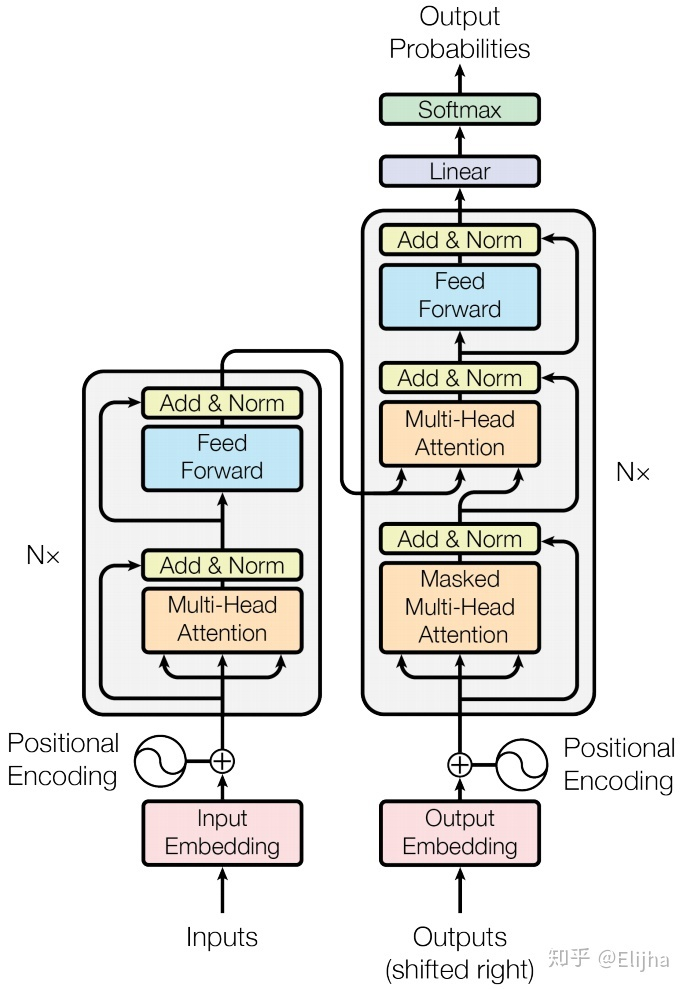

​                                                                         图14 Transformer的总体结构

如图14所示，Transformer模型的输入有两个，其中DECODERS的输入中的shifted right含义就是将DECODERS输入句子的结尾符去掉。Nx表示重复N次。DECODERS的输出经过一个全连接层映射为目标语言词典大小的维度，再进行softmax，取概率最大的单词作为预测的结果。

### **3. 使用训练好的模型预测的过程**

由于译文是未知的，因此不能直接调用模型预测目标句子。

首先把原文输入到ENCODERS中，得到ENCODERS的输出。

之后定义一个列表n存储输出的句子，将n初始化为[S]。（S为句子起始标志）

利用DECODERS循环输出译文。即，定义输出句子的最大长度m，当n的长度小于m时，将n和ENCODERS的输出作为DECODERS的输入，预测下一个单词。下一个单词加入到n的后面，继续利用DECODERS预测下一个单词。以此类推，直到预测的单词为句子的结尾符或者n的长度达到最大长度m为止。

### 4. Transformer需要改进的地方

+ 在真正预测时，模型的每一个输出都依赖于之前的所有输出，是一个顺序的过程，即自回归模型（Auto-regressive Model）。
+ Transformer丢失的位置信息其实在NLP中非常重要，而加入Position Embedding的方法也只是一个权宜之计，并没有改变Transformer结构上的固有缺陷。
+ 有些RNN可以轻易解决的问题transformer没做到，比如复制string，或者推理时遇到的sequence长度比训练时更长（因为碰到了没见过的position embedding）。

### 附录

#### 残差网络

在深度神经网络中有着“两朵乌云”，分别是梯度消失/爆炸和网络退化问题。

梯度消失/爆炸：在深度神经网络训练过程中，根据链式法则，某一层的误差项依赖于后一层的误差项。在反向传播时，如果误差项越来越小的话，就导致最初几层的参数不能有效更新，即梯度消失。如果误差项越来越大，就导致系统不稳定，即梯度爆炸。

网络退化问题：在神经网络可以收敛的前提下，随着网络深度的增加，网络的表现先是逐渐增加至饱和，然后迅速下降。这一点并不符合常理，因为如果存在某个K层的网络f是当前最优的网络，那么可以构造一个更深的网络，其最后几层仅是该网络f第K层输出的恒等映射，就可以取得与f一致的效果；也许K还不是所谓的“最佳层数”，那么更深的网络就可以取得更好的结果。总之，与浅层网络相比，更深的网络的表现不应该更差。为了解释这个问题，一个合理的猜测是，对神经网络来说，恒等映射并不容易拟合。

既然神经网络不容易拟合一个恒等映射，那么一种思路就是构造天然的恒等映射。神经网络非线性单元的输入和输出维度一致时，将单元的输入直接与单元的输出加在一起，然后再激活，这种单元就叫做残差单元，使用残差单元的网络叫做残差网络。

实验表明，残差网络很好地缓解了深度神经网络的退化问题，同等层数下残差网络也收敛得更快。此外，去除个别神经网络层，残差网络的表现不会受到显著影响。而且，残差网络也可以一定程度上缓解梯度消失问题。

#### Batch Normalization和Layer Normalization

BN和LN的主要区别在于normalization的方向不同。

Batch Normalization顾名思义是对一个batch进行操作。假设我们有10行3列的数据，即batch size=10，每一行数据有3个特征，假设这3个特征是[身高、体重、年龄]。那么BN是针对每一列（特征）进行规范化，例如算出“身高”的均值和方差，再对“身高”这一列进行规范化。这是一种“列规范化”。

Layer Normalization方向相反，针对的是每一行进行规范化。即只看一行数据，算出这一行所有特征的均值和方差再规范化。这是一种“行规范化”。

LN对所有特征进行规范化，这显得很没道理，特征的量纲不同会对结果产生很大的影响。但是BN则没有这个影响，因为同一列的量纲是相同的。

然而，对于NLP领域来说，LN却更为合适。如果我们将一批文本组成一个batch，那么BN的操作方向是，对每句话的第一个词进行操作。但语言文本的复杂性是很高的，任何一个词都可能放在初始位置，且词序可能并不影响我们对句子的理解。而BN是**针对每个位置**进行规范化，这**不符合NLP的规律**。

而LN是针对一句话进行规范化的，且**LN一般用在第三维度**，如[batch size,seq_len,dims]中的dims，一般为词向量的维度，或者是RNN的输出维度等，**这一维度各个特征的量纲应该是相同的**，因此就不会遇到上面因为特征的量纲不同而导致的问题。

对于BN而言，batch size的大小会影响BN的效果，而batch size的大小却不会影响LN的效果。

#### 搜索算法

假设现在有一个简化版的中文翻译英文任务，输入为“我” “恨” “你”，输出为“I” “H” “U”。为了方便描述算法，限制输出词典只有{"I","H","U"}这3个候选词，限制1个时间步长翻译1个汉字，1个汉字对应1个英文单词，这里一共3个汉字，因此只有3个时间步长。我们的目标是得到最优的翻译序列I-H-U。

**exhaustive search（穷举搜索）**

最直观的方法就是穷举出所有可能的输出序列，3个时间步长，每个步长3种选择，共计$3^3=27$种排列组合，从所有的排列组合中找到输出条件概率最大的序列。穷举搜索能保证全局最优，但计算复杂度太高，当输出词典稍微大一点时就根本无法使用。

**greedy search（贪心搜索）**

贪心算法在翻译每个字的时候，直接选择条件概率最大的候选值作为当前最优，如图15所示。

+ 第1个时间步长：首先翻译“我”，发现候选“I”的条件概率最大为0.6，所以第一个步长直接翻译成“I”。
+ 第2个时间步长：翻译“我恨”，发现I-I概率0.2，I-H概率0.7，I-U概率0.1，所以选择I-H作为当前步长最优翻译结果。
+ 第3个时间步长：翻译“我恨你”，发现I-H-I概率0.05，I-H-H概率0.05，I-H-U概率0.9，所以选择I-H-U作为最终的翻译结果。

​                                                                                   图15 greedy search

贪心算法每一步选择中都采取在当前状态下最优的选择，通过这种局部最优策略期望产生全局最优解。贪心算法本质上没有从整体最优上加以考虑，并不能保证最终的结果一定是全局最优的。但是相对穷举搜索，搜索效率大大提升。

**beam search（束搜索）**

beam search是对greedy search的一个改进算法，相对greedy search扩大了搜索空间，但远远不及穷举搜索指数级的搜索空间，是二者的一个折中方案。

beam search有一个超参数beam size（束宽），设为k。第1个时间步长，选取当前条件概率最大的k个词，当做候选输出序列的第一个词。之后的每个时间步长，基于上个步长的输出序列，挑选出所有组合中条件概率最大的k个，作为该时间步长下的候选输出序列。始终保持k个候选，最后从k个候选中挑出最优的。

还是以上面的任务为例，假设k=2。

+ 第1个时间步长：如图16所示，I和H的概率是top2，所以第1个时间步长的输出的候选是I和H，将I和H加入到候选输出序列中。

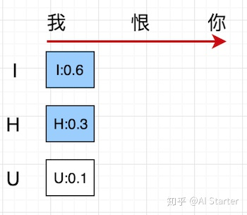

​                                                                                        图16 step1

+ 第2个时间步长：如图17所示，以I开头有三种候选{II,IH,IU}，以H开头有三种候选{HI,HH,HU}。从这6个候选中挑出条件概率最大的2个，即IH和HI，作为候选输出序列。

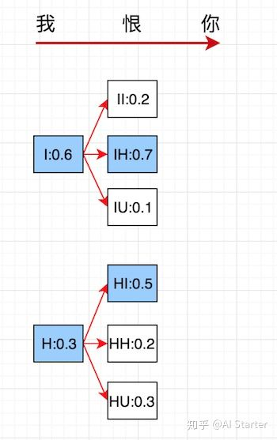

​                                                                                       图17 step2

+ 第3个时间步长：如图18所示，同理，以IH开头有三种候选{IHI,IHH,IHU}，以HI开头有三种候选{HII,HIH,HIU}。从这6个候选中挑出条件概率最大的2个，即IHH和IHU，作为候选输出序列。因为3个步长就结束了，直接从IHH和IHU中挑选出最优值IHU作为最终的输出序列。

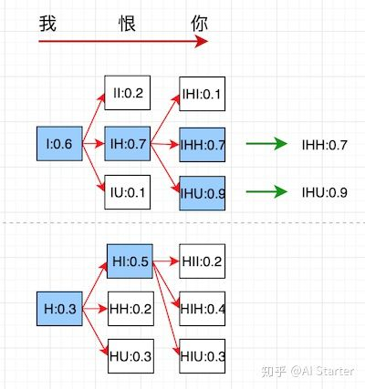

​                                                                                    图18 step3

beam search不保证全局最优，但是比greedy search搜索空间更大，一般结果比greedy search要好。greedy search可以看做是beam size=1时的beam search。

第三小节中使用的是贪心搜索，也可以替换为beam search。