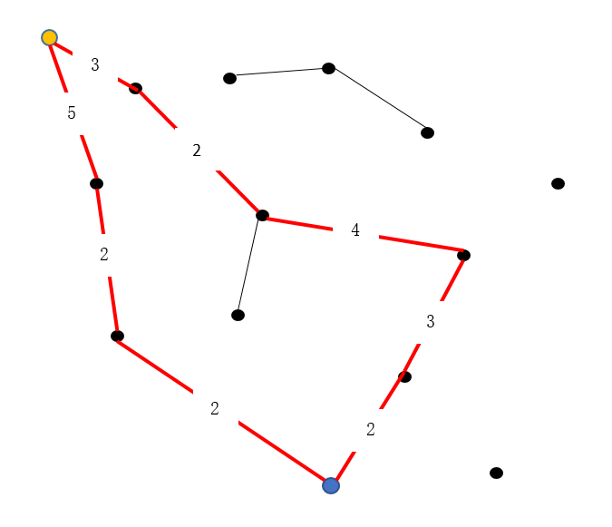

## conceptnet_score

这一部分是计算ending在conceptnet中的得分。

total.csv是在网络上爬取的ConceptNet数据，stopwords是英文停用词表。

**计算ending的得分方法如下**：

边的权值为首端和末端存在的链接数量，黄色节点和蓝色节点的路径有两条。路径1经过的边的权值为3-2-4-3-2，路径1的得分为权值平均值2.8；同理，路径2的得分为3。那么这两个concept之间的得分为所有路径得分的平均值，即2.9。

而前半句话和ending中的concept很可能不止一个，假设前一句话中有3个concept，ending中有4个concept，则需计算3*4=12次，取平均值为该ending的得分。

**程序思路**：

1. 运行build_concept_vocab.py，读取total.csv中的数据，建立concept和relation的词典，保存为concept_vocab.txt和relation_vocab.txt。

2. 运行graph_construction.py，根据total.csv中的数据建立graph，并保存为cpnet.graph。**在实际编码中由于total.csv中的数据量过大，导致程序运行时间很长，因此提取出测试集中的所有concept，在total.csv中查询与这些concept相关的数据，并建立graph。**

3. 运行extract_test_concept.py，提取出测试集中的concept，并保存为test_data_concept.xlsx。

4. 运行cal_conceptnet_score.py，读取test_data_concept.xlsx中的数据，并计算每个ending的conceptnet得分，保存为concept_score.txt。其中，计算conceptnet得分在pathfinder.py中实现。

   

## LSTM_score

这一部分是计算ending在Bi-LSTM中的得分。

model.py功能是训练模型并计算得分，并保存为lstm_score.txt。其中，得分即为二分类的预测结果，值在0和1之间。

## cal_final_score.py

功能是计算总得分和预测的准确度。

首先读取储存conceptnet得分和LSTM得分的文件，之后进行标准化，将得分都转化为0到1之间。每个ending的conceptnet得分与LSTM得分加权相加即为总得分，选择4个ending中总得分最高的作为预测的结果。

## 问题

1. 使用的ConceptNet数据量较少，而且网上爬取的conceptnet数据的质量有限，可能对结果有一些影响。
2. 最后加权计算总得分时，conceptnet得分的权值增加时，预测的准确率反而会降低。说明conceptnet得分的计算方法还需优化，仅仅通过边的权值计算可能不够科学。