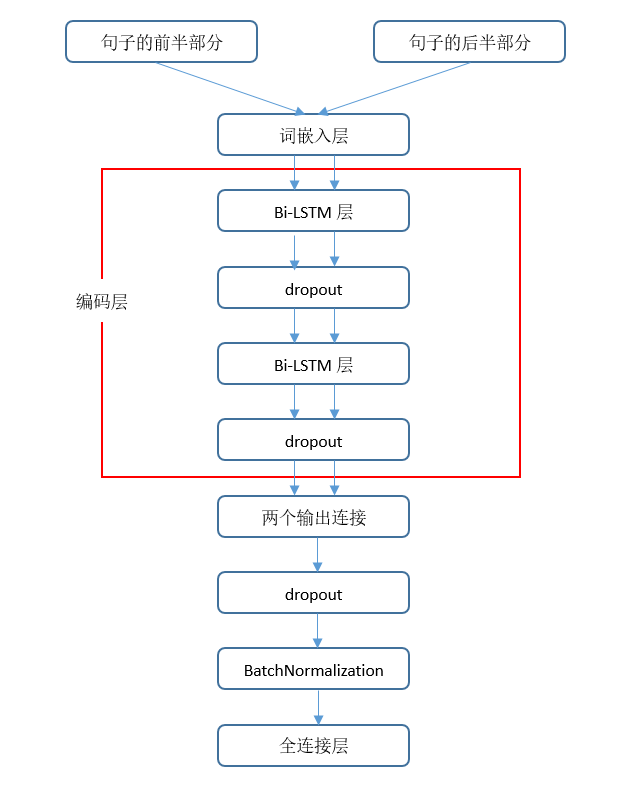

## Bi-LSTM模型

bi-lstm.py即为代码实现。

**模型的输入**：包括两个，句子的前半部分和后半部分。

**模型结构**：

1.词嵌入层

两个输入使用同一个词嵌入矩阵，转换为固定大小（embedding_dim * max_length）的矩阵。

2.编码层

包括两个Bi-LSTM层和两个dropout，两个输入共用，权值共享。

3.使用concatenate函数将编码层的输出拼接在一起。

4.使用BatchNormalization函数规范化。

5.输出层

即全连接层，激活函数为sigmoid。

6.模型的损失函数为二分类损失函数binary_crossentropy，优化器为SGD。

**模型的参数：**

词向量的维度为128，batch大小为25，在观察数据后将句子的最大长度设为80.

**模型的训练以及结果：**

原数据集中有4个选项，只有一个选项是合理的。将其转换为二分类问题，模型的输入包括句子的前半部分和后半部分，后半部分合理时标签为1，否则为0.

由于数据量较大，训练集设置为5000条数据，测试集设置为5000条数据。epoch为10时，测试集上的准确率为0.33.

**问题：**

原数据集一条有四个选项，只有一个选项是对的。转换为二分类的数据集后，类别为0的数据有三条，类别为1的数据只有1条，导致训练集中的类别1的数据较少，对模型的准确度有一定影响。

## RoBERTa文本蕴含

roberta.py是调用roberta模型的代码，cal_accuracy.py是计算roberta模型的结果准确度的代码。

加载的是roberta.large.mnli模型，使用的是文本蕴含功能。其中，两个文本之间的关系包括矛盾、中立和蕴含三种。

**程序思路**：

每句话对应的ending有四个，分别计算这4个ending与前半句话在“蕴含”关系上的得分，选择得分最高的ending作为预测的结果。

**问题**：

通过观察数据集发现，由于前半句话和ending都可能不是完整的一句话，而且形式和文本蕴含也不怎么相同，因此hellaswag不能简单地转换为文本蕴含问题来解决。