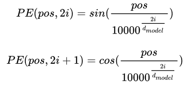
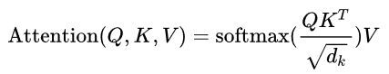
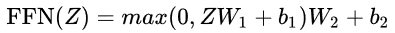

# Transformer

### 1. Why Transformer?

LSTM的缺点：

长期依赖问题导致梯度消失；时序模型，只能串行计算，导致效率低。

Transformer的解决方法：

在self-attention中两两计算score，每个单词的重要性都是相同的，不会因为在句中的距离过远而导致重要性下降。

与时序无关，可以并行计算，便于利用GPU的算力。

LSTM中考虑上下文的方法是时序机制，Transformer中考虑上下文的方法是attention机制。

### 2. Transformer详解

#### 2.1 高层次的结构展示

我们以机器翻译为例子，Transformer在解决机器翻译任务时可概括为下图：

Transformer本质上是一个Encoder-Decoder的结构，那么上图可以表示为下图：

其中，如下图所示，编码器由6个编码block组成，解码器也由6个解码block组成，两个block的数量要相同，这里block的数量可以凭借经验设定。与所有的生成模型相同的是，编码器的输出会作为解码器的输入。

Encoder的结构如下，数据首先经过self-attention模块，这个模块可以考虑到上下文，再经过Feed Forward Neural Network模块，具体的细节在之后说明。

Decoder的结构如下，与Encoder相比多了一个Encoder-Decoder Attention。其中，self-attention的作用是考虑当前的翻译和已经翻译的前文的关系，Encoder-Decoder Attention的作用是考虑当前翻译和编码的特征向量之间的关系。

#### 2.2 输入编码

上面介绍的是Transformer的主要框架，下面介绍它的输入数据。

如上图所示，首先通过Word2Vec等词嵌入方法将输入的语料转化为词向量，即图中的EMBEDDINGS。

为了捕捉输入序列的顺序信息，引入了位置编码的方法，即图中的POSITIONAL ENCODING，这样Transformer就能够区分不同位置的单词了。编码位置信息的常见方法有：a.根据数据学习；b.自己设计编码规则。这里采用第二种方式，编码公式如下：

其中，pos表示单词的位置，i表示单词的维度，i为偶数时用第一个公式，i为奇数时用第二个公式。这样既能考虑到单词的绝对位置，也能考虑到单词的相对位置。

之后将EMBEDDINGS和POSITIONAL ENCODING相加得到最终的输入。值得注意的是，这个输入只是最底层的block的输入，其他层的输入则是上一层的输出。

#### 2.3 self-attention

相同的单词在不同句子中的词向量应该是不同的，然而传统的embedding方法没有考虑到这一点，self-attention则能够考虑到上下文的信息来生成向量。self-attention的计算公式如下：

具体的计算步骤如下图所示：

在self-attention中，每个单词有3个不同的向量，分别是Query向量（q），Key向量（k）和Value向量（v）。q，k，v由原始词向量乘以3个不同的权重矩阵得到，3个权重矩阵的尺寸是相同的。

q乘k得到score（本身word的q和句子里所有word的k相乘），含义是这个单词和句子中的所有单词的“依赖程度”。具体理解如下图，颜色越深表示与单词'it'的score越高，即“依赖程度”越高。可以看出'it'对'The animal'的score最高，即对单词'it'来说，模型将”注意力“更多放在了'The animal'上面。

为了缩小score之间的差距，方便之后的softmax处理，将score除以一个数，这个数是根据经验设定的，这里是$\sqrt{d_k}$，$d_k$是k的维度。之后再进行softmax，softmax之后的值作为权重与对应的v相乘，再相加得到最后的考虑了上下文的向量。

在实际计算中采用的是矩阵的计算方式，也就是上面的公式的计算方式。

另外，为了解决深度学习中的退化问题，加入了残差连接结构。所以Encoder的最终结构如下图，其中的Add操作即为残差连接。（残差连接的含义是将输出和输入相加作为最终的输出）

#### 2.4 multi-head attention

multi-head attention相当于h个不同的self-attention的集成，这里以h=8为例。

有8套权重矩阵与原始词向量相乘，相当于从不同的角度看待同一句话。经过self-attention后得到8个输出z，再将它们按列拼接起来，与一个权重矩阵相乘，得到一个维度较小的矩阵作为输出。整个过程如下图所示：

与self-attention一样，multi-head attention也加入了残差连接结构，相当于把Encoder中的self-attention模块换成multi-head attention。

#### 2.5 Feed Forward Neural Network

这个模块可以看做是两个全连接层，第一层的激活函数是ReLU，第二层是一个线性激活函数，公式如下：

#### 2.6 Encoder-Decoder Attention

Decoder比Encoder多了一个encoder-decoder attention模块，在这个模块中，Q来自于解码器的上一个输出，K和V来自于编码器的输出，之后的计算方式和self-attention完全相同。

#### 2.7 mask的使用

mask的含义是掩码，作用就是对某些值进行掩盖，使其不产生效果。

Transformer中涉及到2种mask，分别是padding mask和sequence mask。padding mask在所有的scaled dot-product attention里都需要用到，而sequence mask只在decoder的self-attention中用到。

**padding mask**

由于模型每个batch的输入句子长度不一致，因此需要进行padding操作（多裁少补）。在scaled dot-product attention中我们不应该把注意力放在这些补充的位置上，因此我们把这些位置的值加上负无穷，这样在softmax之后，这些位置的概率就会接近0。

**sequence mask**

decoder需要有一个输入，即decoder之前的所有输出，而为了避免decoder受到未来的信息的影响，引入了sequence mask机制。具体做法就是生成一个上三角矩阵，上三角的值全为1，下三角和对角线为0，这样t时刻的输出就只依赖于该时刻之前的输出，不会受到之后的值的影响。

#### 2.8 Transformer总体结构

这里以encoder和decoder的block数量为2举例。

### 3. Transformer实现

模型的输入包括两个：encoder的输入，decoder的输入。

输出有一个：decoder的输出。

在具体实现模型时，要将输入输出的数据进行一些处理。decoder的输入需要在起始位置加上标志符'S'，decoder的有效输出的结尾应该加上结尾标志符'E'，此外，2个输入和1个输出都要进行padding处理，但是需要注意不要把结尾标志符'E'裁剪掉。例如，句子paddding之后的长度为6时，格式如下：

encoder输入：'ich  mochte  ein  P  P  P'

decoder输入：'S  i  want  a  beer  P'

decoder输出：'i  want  a  beer  E  P'

**模型运行过程：**

由于引入了sequence mask机制，所以decoder的输入是随着时间变化的。

t1时刻：

decoder输入：'S'

decoder输出：'i'

t2时刻：

decoder输入：'S i'

decoder输出：'i want'

t3时刻：

decoder输入：'S i want'

decoder输出：'i want a'

t4时刻：

decoder输入：'S i want a'

decoder输出：'i want a beer'

t5时刻：

decoder输入：'S i want a beer'

decoder输出：'i want a beer E'

在使用训练好的模型进行预测时，decoder的输入可以使用Greedy decoder计算得到，再和encoder的输入一起输入到模型里。

注：在解决生成类任务时decoder的输入应该提前用一些方法生成，在解决句子ending选择类任务时，可以使用ending作为decoder的输入。